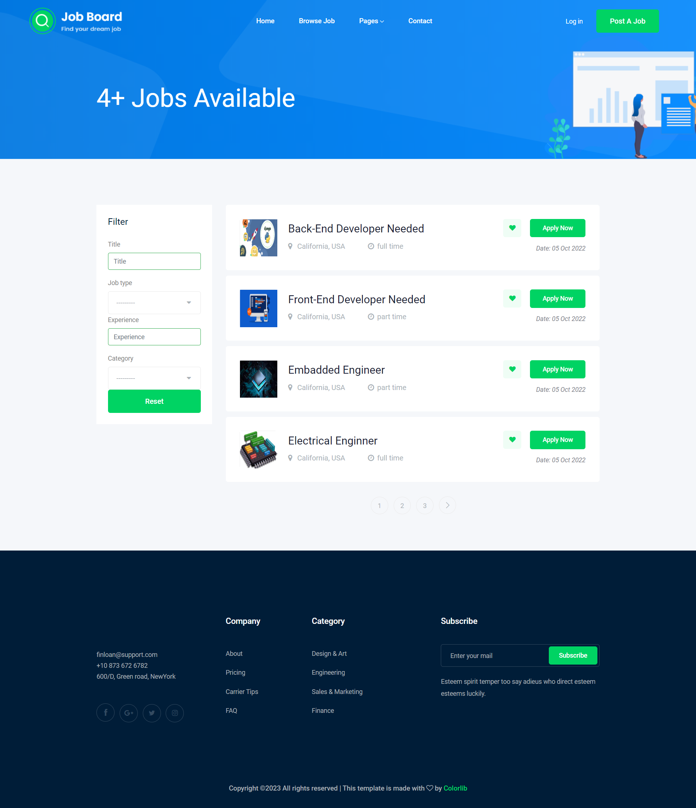

"# Job-Board-Django" 

This is a Django web application for managing job listings.

## Database:

1. ### Job Table:

   - `owner`: linking to the User model, representing the owner of the job.
   - `title`: for the job title.
   - `job_type`: with choices for job types (full time or part time).
   - `description`: for the job description.
   - `published_at`: DateTimeField representing the date and time the job was published.
   - `vacancy`:  for the number of vacancies.
   - `salary`: for the job salary.
   - `experience`: for required experience.
   - `category`: linking to the Category model, representing the job category.
   - `image`: uploading an image related to the job.
   - `slug`: for a URL-friendly version of the title.

2. ### Category Table:

   `name`: for the category name.

3. ### Apply Table:

   - `job`: linking to the Job model, representing the job to which the application is submitted.
   - `name`: for the applicant's name.
   - `email`: for the applicant's email.
   - `website`: for the applicant's website.
   - `cv`: for uploading the applicant's CV.
   - `cover_letter`: for the applicant's cover letter.
   - `created_at`: representing the date and time the application was created.

4. ### Info Table:

   - `place`: for the location or place associated with the contact information.
   - `phone_number`: for the phone number.
   - `email`: for the contact email.

## Main Operations:

1. **job_list:**
   - Fetches all jobs, applies filters if any, and paginates the results.
2. **job_detail:**
   - Fetches a specific job based on the slug.
   - Handles form submissions for job applications.
3. **add_job:**
   - Requires user authentication.
   - Handles form submissions for adding new jobs.
   - Associates the job with the current user as the owner.
   - Redirects to the job list after a successful job addition.

4. **send_message:**
   - Retrieves the latest (last) Info object from the database.

---

