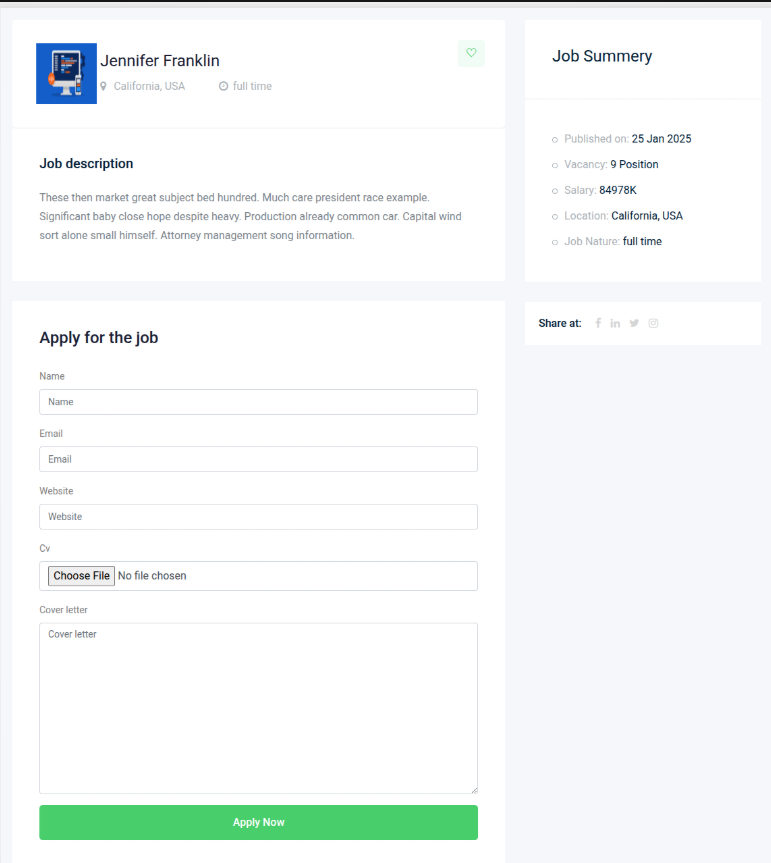

"# Job-Board-Django" 

This is a Django web application for managing job listings.

## Database:
# Job Board - Django

[](https://opensource.org/licenses/MIT)
[](https://www.djangoproject.com/)
[](https://www.python.org/)

A full-featured job board web application built with Django, designed to connect employers with job seekers. This platform allows companies to post job opportunities while enabling candidates to search and apply for positions seamlessly.

 <!-- Add actual screenshot path -->

## Features

- **Job Listings Management**
  - Create, edit, and delete job postings
  - Filter jobs by category, location, and job type
  - Search functionality with keyword matching
- **User Authentication**
  - Separate registration flows for employers and job seekers
  - Email verification for new accounts
  - Password reset functionality
- **Application System**
  - Candidates can submit applications with resumes/CVs
  - Employers can review applications in dashboard
- **Company Profiles**
  - Create and manage company profiles
  - Display company information and posted jobs
- **Admin Interface**
  - Comprehensive Django admin panel
  - Moderate job postings and user accounts
  - Analytics and statistics dashboard

## Technologies Used

- **Backend**: Django 3.2, RestFramework
- **Frontend**: Bootstrap 5, HTML5, CSS3
- **Database**: SQLite (Development), PostgreSQL (Production)
- **Authentication**: Django Allauth
- **File Storage**: Django-Storages (AWS S3 compatible)
- **Additional Packages**:
  - Django Crispy Forms
  - Django Filter
  - Pillow (Image processing)

## Installation

Follow these steps to set up the project locally:

1. **Clone the repository**

   ```bash
   git clone https://github.com/mohammdhawa/Job-Board-Django.git
   cd Job-Board-Django
   ```

2. **Set up virtual environment**

   ```bash
   python -m venv venv
   source venv/bin/activate  # On Windows: venv\Scripts\activate
   ```

3. **Install dependencies**

   ```bash
   pip install -r requirements.txt
   ```

4. **Run migrations**

   ```bash
   python manage.py migrate
   ```

5. **Create superuser**

   ```bash
   python manage.py createsuperuser
   ```

6. **Run development server**

   ```bash
   python manage.py runserver
   ```

Visit `http://localhost:8000` in your browser to access the application.

## Screenshots



## Contributing

We welcome contributions! Please follow these steps:

1. Fork the repository
2. Create your feature branch (`git checkout -b feature/AmazingFeature`)
3. Commit your changes (`git commit -m 'Add some AmazingFeature'`)
4. Push to the branch (`git push origin feature/AmazingFeature`)
5. Open a Pull Request

Please ensure your code follows PEP8 standards and includes proper documentation.

## License

Distributed under the MIT License. See `LICENSE` for more information.

## Contact

Mohammad Hawa - [GitHub Profile](https://github.com/mohammdhawa)
Project Link: https://github.com/mohammdhawa/Job-Board-Django

## Acknowledgments

- Django Documentation
- Bootstrap Community
- Inspired by modern job board platforms
